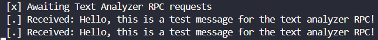
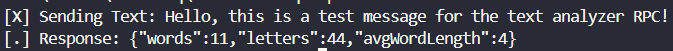

# RPC-rabbitmq
This project demonstrates a simple Remote Procedure Call (RPC) system using RabbitMQ and TypeScript.
The client sends a text string to the server via a message queue. The server analyzes the text and returns a JSON object containing:

+ the number of words
+ the number of letters (alphabetical characters only)
+ the average word length

##### Example:
Client sends: `"Hello world from RabbitMQ"`
Server responds: `{ "words": 4, "letters": 21, "avgWordLength": 5.25 }`

The project showcases asynchronous messaging, correlation of requests and responses, and JSON data handling over RabbitMQ.

### Project Setup
#### Requirements
+ Node.js + TypeScript
+ `amqplib` (RabbitMQ-Client für Node.js)
+ RabbitMQ-Server (lokal oder Cloud)


#### Installation
```bash
npm init -y
npm install amqplib typescript ts-node @types/node
npx tsc --init
```

### Usage

#### Start rabbitmq with docker
Starting rabbitmq server with docker command `docker run -it --rm --name rabbitmq -p 5672:5672 -p 15672:15672 rabbitmq:4-management`

#### Run typescript files
1. Start `server.ts` with command `npx ts-node server.ts`
2. Start `client.ts` with command `npx ts-node client.ts`

#### Results
##### Server


##### Client

